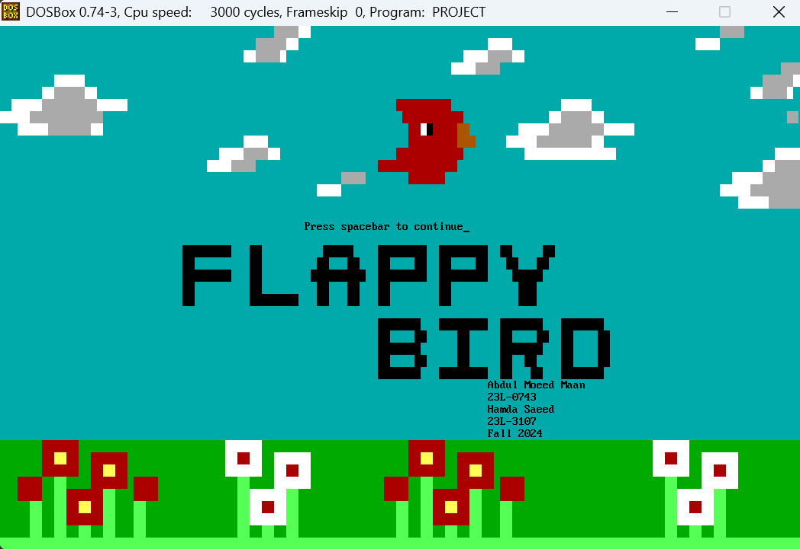

# 🚀 Flappy Bird in Assembly Language! 🐦💻

Welcome to our final semester project for the Assembly Language course — a fully playable **Flappy Bird game**, built from scratch using **x86 Assembly (NASM)** and run inside **DOSBox**!

---

## 👨‍💻 Team
Developed in collaboration with my brilliant teammate **Abdul Moeed Maan**, this project was an intense and rewarding journey into the world of low-level programming, graphics rendering, and hardware interrupt handling — all constrained by the rules of **x86 architecture**.

---

## 🛠️ Tech Stack
- **NASM (x86 Assembly)**
- **DOSBox Emulator**
- **BIOS interrupts:** `INT 10h` (graphics), `INT 21h` (keyboard handling)

---

## 🎮 Key Features
- 🎯 Classic **Flappy Bird mechanics** — jump, avoid pipes, keep flying!
- 🧱 **Pixel-based rendering** in **VGA graphics mode**
- 🎹 **Real-time keyboard input** & live scoring system
- 💾 **No high-level libraries** — fully built for the DOS environment

---

## 💡 What I Learned
This project was a masterclass in:
- Manual memory handling
- Interrupt-driven input and rendering
- Writing clean, logical, optimized assembly code
- Debugging at the most granular level

It taught us the **raw power of low-level programming** — and just how much you can build without modern frameworks.

---

## 🎯 Why It Matters
In today’s world of high-level abstractions, it’s easy to forget what happens underneath. This game is more than just nostalgic fun — it’s a tribute to foundational computing. Every pixel, every jump, every score is handcrafted logic. 💻✨

---

## 🔗 Demo Link
📁 [[project demo link here](https://drive.google.com/file/d/1JmFfoxeZdxUWMFyrOp3HfZibNzYdrp_4/view?usp=sharing)]

---

## 🙌 Feedback?
We’d love to hear your thoughts, suggestions, or see any similar projects you’ve worked on!

---

### Made with 💾 by Hamda Saeed & Abdul Moeed Maan
